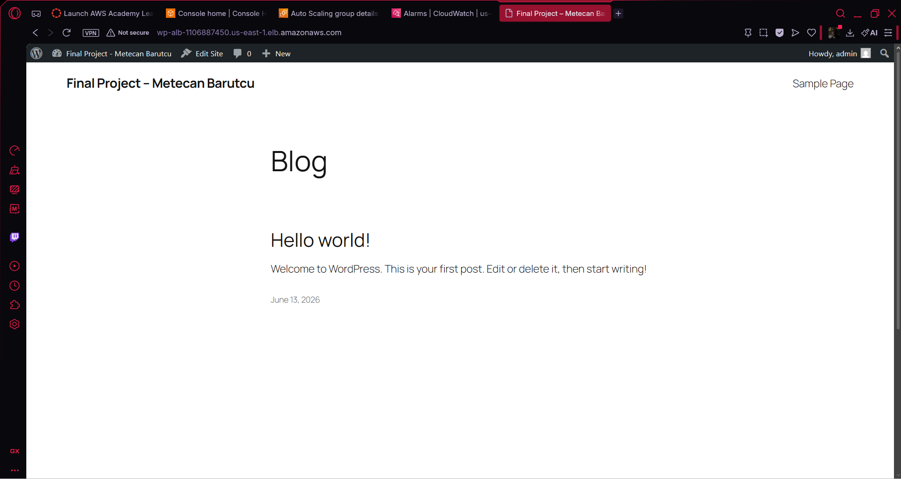
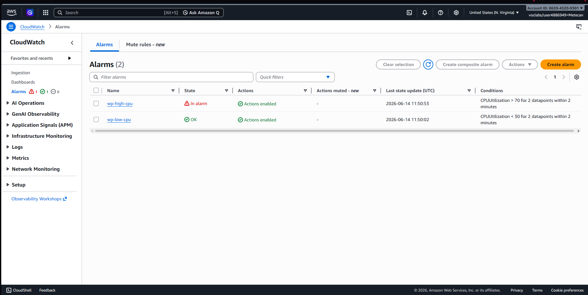
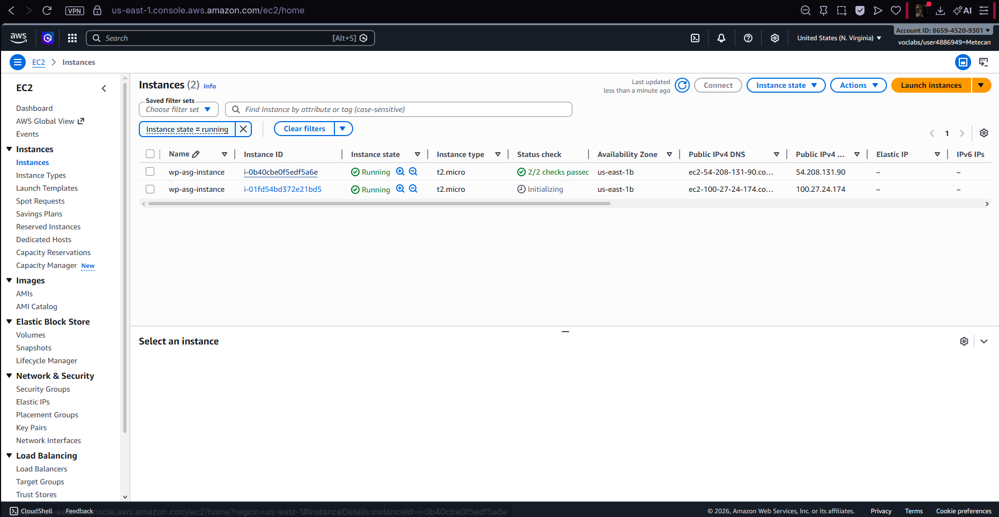

# WordPress High Availability on AWS

A scalable, highly available WordPress deployment on AWS using Terraform for Infrastructure as Code (IaC).

## Architecture

- **VPC** — Custom VPC with public and private subnets configured across multiple AZs
- **ALB** — Application Load Balancer distributes traffic across EC2 instances
- **ASG** — Auto Scaling Group (min: 1, max: 3) scales based on CPU usage
- **RDS** — Managed MySQL 8.0 database (replaces local MariaDB from previous assignments)
- **S3** — Media storage bucket for WordPress uploads
- **CloudWatch** — CPU alarms trigger scale-out at 70%, scale-in at 30%

## What's New (vs Assignment 05)

| Component | Assignment 05 | This Project |
|-----------|--------------|--------------|
| Database  | MariaDB on EC2 | **RDS MySQL 8.0** |
| Scaling   | Fixed 2 EC2s | **ASG min:1 max:3** |
| Monitoring | None | **CloudWatch alarms** |
| Networking | Default VPC | **Custom VPC + subnets** |
| IaC | 3 separate terraform folders | **Single unified deployment** |

## Screenshots

| WordPress Site | CloudWatch Alarm | ASG Scale-Out |
|---|---|---|
|  |  |  |

## Prerequisites

- AWS Academy credentials configured (`aws configure`)
- Terraform installed
- WSL/Ubuntu (for running scripts)

## Deployment

```bash
cd terraform
terraform init
terraform plan
terraform apply
```

After apply (~10 min for RDS), open the ALB DNS from outputs:

```bash
terraform output alb_dns_name
```

## Cleanup

```bash
terraform destroy
```

## Repository Structure

```
├── terraform/
│   ├── main.tf           # All AWS resources
│   ├── variables.tf      # Input variables
│   ├── outputs.tf        # Output values
│   └── terraform.tfvars  # Instance types, bucket name
├── scripts/
│   └── user-data.sh      # WordPress install + RDS config
├── docs/
│   ├── report.md         # Project report
│   └── Screenshots/      # Evidence screenshots
├── finished.txt          # Deployment summary
└── README.md
```

## Based On

Extended from [Assignment 05 - WordPress HA](https://github.com/mobile-os-dku-cis-mse/05-2-wp-with-ha-setting-metebar) with RDS, ASG, CloudWatch, and custom VPC added.